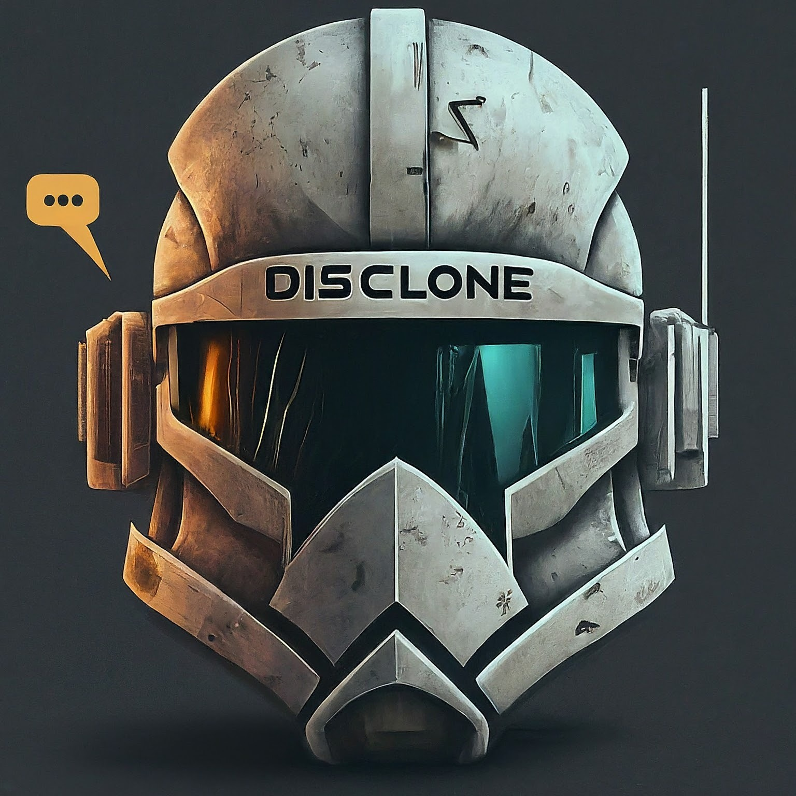

# Disclone

> The Educational Discord Clone

Discord is a service that allows a large community of online individuals to come together and communicate freely about many different topics, such as video games, school/university, work, etc. Many online services such as Reddit, Twitter, among others, allow users to interact with each other in a forum or thread format. Discord's innovative approach allowed users to interact with each other in real-time. Disclone is an educational exploration that aims to connect users intuitively using this established approach of real-time chat while using a more friendly UI.

## Developing

Here's how to get started looking at the source code and developing locally:

- This application was developed using Docker + Compose. If you do not have Docker Desktop already installed, please visit the [Docker](https://www.docker.com/products/docker-desktop/) site, create an account if you wish, and install it.

- Next, clone this repository to your local machine with the following command:

  ```bash
  git clone https://github.com/CP-DISCLONE/disclone.git
  ```

- Navigate to the `scripts` directory and run the following commands to install application dependencies locally:

  ```bash
  chmod +x ./install.sh # Makes the script executable on your machine
  ./install.sh # Installs project dependencies
  ```

- Finally, navigate back to the root `disclone` directory and run the following commands:
  ```bash
  docker compose build # Builds the images for containers
  docker compose up # Spins up the containers
  docker compose down # After you exit the containers and wish to bring them down
  ```

## Purpose

> The Educational Benefits of this Application

This project was a way for our group to implement many new concepts that we had little experience working with. Creating our own asnychronous application with Django Channels and Redis was a challenge, but we gained a lot of knowledge doing so. If you would like to see more about the project structure and architecture, please see: [Architecture](./docs/architecture.md).

## Founders

The Members and Developers of this project are:

- [Nathan Pennington](https://github.com/penningtron)
- [Jordan Edgington](https://github.com/Jordan-Edgington)
- [Jordan Yamada](https://github.com/JordanYamada)
- [Stephen Thomas](https://github.com/madghost41)
- [Adrian Garcia](https://github.com/Muffy239)
- [Tom Childress](https://github.com/chiltom)

## Contributing

If there's anything that you'd like to contribute or make suggestions for, please fork the repository and use a feature branch. We'd love to see a pull request and will evaluate it as soon as possible.

## Links

- Repository: https://github.com/CP-DISCLONE/disclone
- Issue tracker: https://github.com/CP-DISCLONE/disclone/issues
  - In case of any sensitive issues such as security vulnerabilities, please contact one of the founders above by email directly. We highly appreciate any effort to improve our application's security and privacy!

<br/>

<div align="center">©DISCLONE 2024</div>
